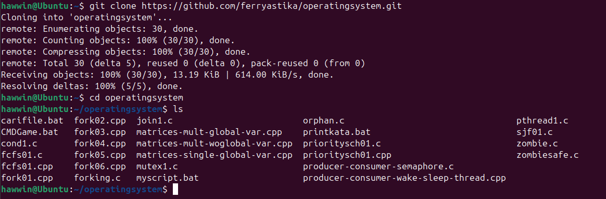
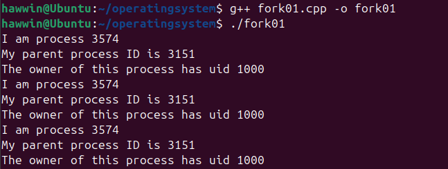
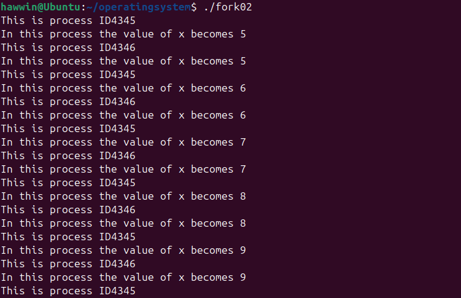
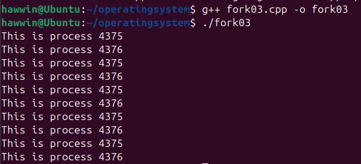
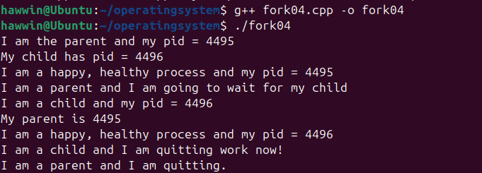
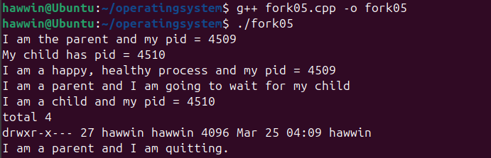

# LAPORAN LATIHAN SISTEM OPERASI

## DOSEN PENGAMPU
Dr. Ferry Astika Saputra, ST, M.Sc

## NAMA PEMBUAT
MUCHAMMAD HAWWIN ROMADHON

KELAS : IT A

NRP : 3124521003

POLITEKNIK ELEKTRONIKA NEGERI SURABAYA PSDKU LAMONGAN

---

### Fork : Parent - Child Process

• Akses dan clonning repo : https://github.com/ferryastika/operatingsystem.git

    
---

• Deskripsikan dan visualisasikan pohon proses hasil eksekusi dari kode program 

    fork01.c, fork02.c, fork03.c, fork04.c, fork05.c dan fork06.c.

---

### fork01.c    

• Visualisasi Pohon Proses

    pid: 3574, ppid: 3151
    [Main process]

• Deskripsi

    1. PID 3574 → Ini adalah process ID (PID) dari program yang sedang berjalan.
    
    2. PPID 3151 → Ini adalah parent process ID (PPID), yang kemungkinan adalah terminal atau shell yang menjalankan program.
    
    3. User ID (UID) 1000 → Ini adalah ID pengguna yang menjalankan proses.

    4. Proses utama mencetak informasi sebanyak 3 kali karena ada loop for (int i = 0; i < 3; i++).

---

### fork02.c

• Visualisasi Pohon Proses

    pid: 4345, ppid: 3151
    [Parent Process]
       |
       +--> fork() memunculkan child process
       |
       +--> pid: 4346, ppid: 4345
            [Child Process]

• Deskripsi

    1. Proses utama (pid: 4345) dijalankan pertama kali.
    
    2. fork() dipanggil, yang menyebabkan sistem menciptakan proses anak (pid: 4346).
    
    3. Kedua proses (induk & anak) memiliki variabel x, tetapi nilainya tidak dibagikan karena proses berjalan di memori  
    
    terpisah.
    
    4. Kedua proses menjalankan loop while (1), sehingga mereka terus mencetak PID dan nilai x masing-masing.
    
    5. Terlihat dua PID berbeda (4345 dan 4346) yang mencetak angka yang sama secara bergantian, karena mereka berjalan
    
    bersamaan.

---

### fork03.c

• Visualisasi Pohon Proses

    pid: 4375, ppid: 3151
    [Parent Process]
       |
       +--> fork() memunculkan child process
       |
       +--> pid: 4376, ppid: 4375
            [Child Process]

• Deskripsi

    1. Proses utama (pid: 4375) pertama kali dijalankan.
    
    2. fork() membuat proses anak (pid: 4376).
    
    3. Kedua proses menjalankan perulangan dan mencetak "This is process 4375" dan "This is process 4376" secara bergantian.
    
    4. Karena sistem multitasking, urutan eksekusi tidak selalu teratur, sehingga output terlihat bergantian antara dua     
    
    proses.

---    

### fork04.c

• Visualisasi Pohon Proses

    pid: 4495, ppid: 3151
    [Parent Process]
       |
       +--> fork() membuat child process
       |
       +--> pid: 4496, ppid: 4495
            [Child Process]

• Deskripsi

    1. Proses utama (pid: 4495) pertama kali dijalankan.
    
    2. fork() membuat proses anak (pid: 4496).
    
    3. Proses induk mencetak PID anaknya → "My child has pid = 4496"
    
    4. Proses anak mencetak PID induknya → "My parent is 4495"
    
    5. Proses induk menunggu anaknya selesai dengan wait() → "I am a parent and I am going to wait for my child"
    
    6. Proses anak menyelesaikan tugasnya dan keluar → "I am a child and I am quitting work now!"
    
    7. Setelah anak keluar, induk juga keluar → "I am a parent and I am quitting."

---    

### fork05.c

• Visualisasi Pohon Proses

    pid: 4509, ppid: 3151
    [Parent Process]
       |
       +--> fork() membuat child process
       |
       +--> pid: 4510, ppid: 4509
            [Child Process] (menjalankan `ls`)

• Deskripsi
    
    1. Proses utama (pid: 4509) pertama kali dijalankan.
    
    2. fork() membuat proses anak (pid: 4510).
    
    3. Proses induk mencetak PID anaknya → "My child has pid = 4510"
    
    4. Proses anak mencetak PID induknya → "I am a child and my pid = 4510"
    
    5. Proses anak menjalankan perintah sistem ls → Menampilkan daftar file/folder di direktori
    
    6. Proses induk menggunakan wait() untuk menunggu anak selesai → "I am a parent and I am going to wait for my child"
    
    7. Setelah ls selesai, proses anak keluar, lalu proses induk keluar → "I am a parent and I am quitting."

---    
