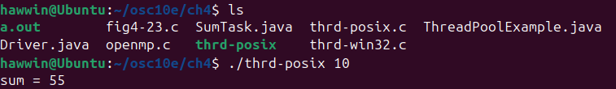
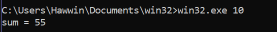

# LAPORAN LATIHAN SISTEM OPERASI

## DOSEN PENGAMPU
Dr. Ferry Astika Saputra, ST, M.Sc

## NAMA PEMBUAT
MUCHAMMAD HAWWIN ROMADHON

KELAS : IT A

NRP : 3124521003

POLITEKNIK ELEKTRONIKA NEGERI SURABAYA PSDKU LAMONGAN

---

A. Penerapan thread pada contoh SumTask.java 

Jawaban :

B. penerapan Thread di Linux (thrd-posix.c) dan 

Jawaban :

C. penerapan thread di Microsoft Windows (thrd-win32.c).

Jawaban :

