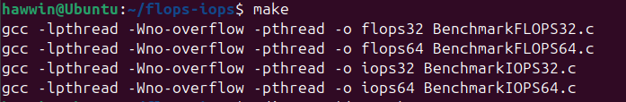
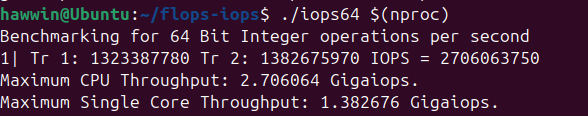
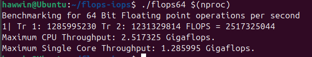

# LAPORAN LATIHAN SISTEM OPERASI

## DOSEN PENGAMPU
Dr. Ferry Astika Saputra, ST, M.Sc

## NAMA PEMBUAT
MUCHAMMAD HAWWIN ROMADHON

KELAS : IT A

NRP : 3124521003

POLITEKNIK ELEKTRONIKA NEGERI SURABAYA PSDKU LAMONGAN

---

### FLOPS IOPS

1.mengomentari make file dan output dari program

    $make
  	
  

    Komentar dari saya :
   
    Program ini dikompilasi dengan dukungan multi-threading, yaitu (-lpthread dan -pthread)

---
    
    $ ./flops64 $ (nproc)

  

    Komentar dari saya : 

    1. Tr 1: 1323387780 dan Tr 2: 1382675970 Menunjukkan jumlah operasi integer 64bit yang dihitung dalam dua tahap pengujian

    2. IOPS = 2706063750 Total jumlah operasi integer  64bit yang dilakukan perdetik 2,7 milyar operasi perdetik (2.7 GigaIOPS)

    3. Maximum CPU Throughput: 2.706064 Gigaiops kapasitas maksimum CPU dalam menangani operasi integer 64bit secara keseluruhan menggunakan semua core yang tersedia

    4. Maximum Single Core Throughput: 1.382676 Gigaiops. kapasitas maksimum satu core CPU dalam menangani operasi integer 64bit

---

    $ ./iops64 $ (nproc)

   

    Komentar dari saya :

    1.	Tr 1: 1285995230 & Tr 2: 1231329814 Menunjukkan jumlah operasi floating point 64bit yang dihitung dalam dua tahap pengujian

    2.	FLOPS = 2517325044 Total jumlah operasi floating point 64bit yang dilakukan per detik 2.51 milyar operasi per detik (2.51 GigaFLOPS)

    3.	Maximum CPU Throughput: 2.517325 Gigaflops kapasitas maksimum CPU dalam menangani operasi floating point 64bit secara keseluruhan menggunakan semua core yang tersedia

    4.	Maximum Single Core Throughput: 1.285995 Gigaflops. kapasitas maksimum satu core CPU dalam menangani operasi floating point 64bit

---

### KESIMPULAN

    •	IOPS lebih cepat daripada FLOPS
    •	Performa multi core cukup seimbang tidak beda jauh

---

SELESAI
