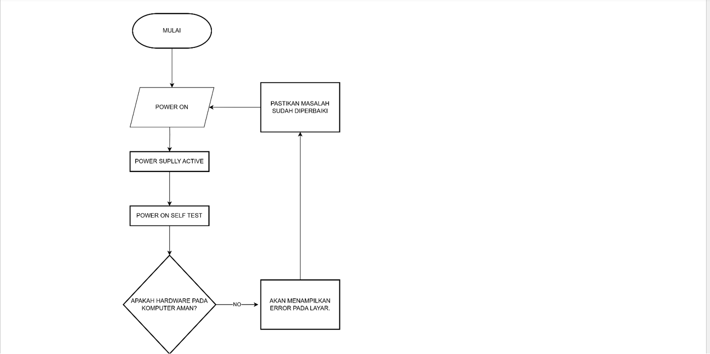
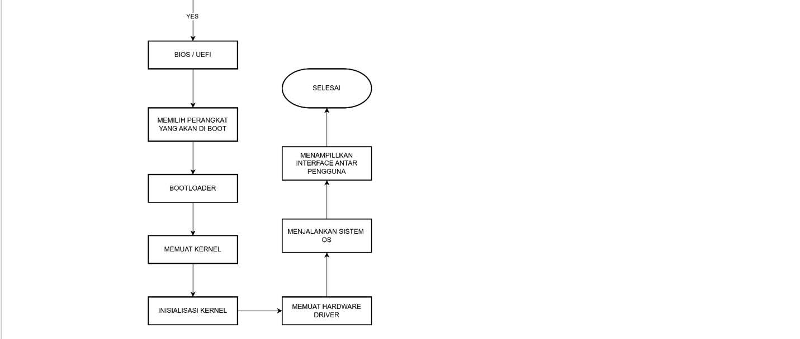

# LAPORAN LATIHAN SISTEM OPERASI

## DOSEN PENGAMPU
Dr. Ferry Astika Saputra, ST, M.Sc

## NAMA PEMBUAT
MUCHAMMAD HAWWIN ROMADHON

KELAS : IT A

NRP : 3124521003

POLITEKNIK ELEKTRONIKA NEGERI SURABAYA PSDKU LAMONGAN

---

1.Membuat flowchart untuk proses dari komputer dinyalakan, bootstrap, dst hingga komputer bisa digunakan.

---

•	BOOTSTRAP

•	Mulai : Untuk memulai proses menyalakan computer

•	Power On : untuk menyalakan computer

•	Power Supply Active : power supply aktif akan mengirimkan daya listrik ke computer

•	Power Self On test : akan mengecek komponen (hardware) yang akan dijalankan, jika ada kendala maka akan muncul error pada layar, pastikan masalah sudah diperbaiki maka akan lanjut ke proses awal yaitu power on

•	BIOS/UEFI : lalu masuk ke bios, kemudian memilih perangkat yang ingin diboot

•	Bootloader : Memproses boot yang sudah dipilih, lalu memuat kernel

•	Inisialisasi Kernel : memeriksa perangkat keras/lunak agar berjalan dengan baik, kemudian menjalankan hardware driver

•	Sistem OS : lalu menjalankan system operasi yang dipilih pengguna contoh windows

•	Selesai : Komputer bias digunakan

---

SELESAI
